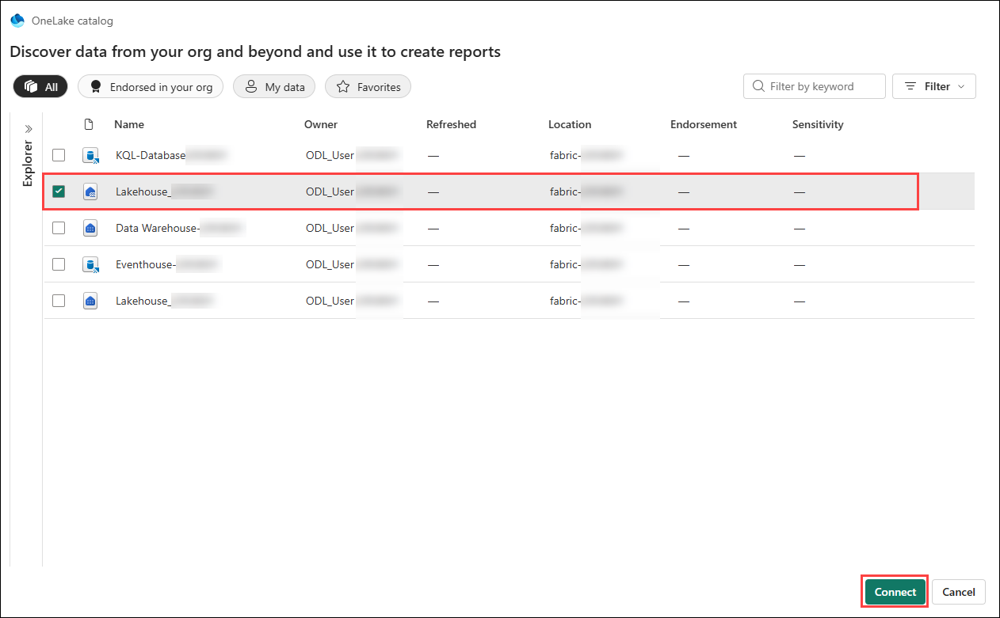
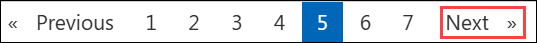

# Exercise 4: Use notebooks to train a model in Microsoft Fabric

### Estimated Duration: 90 Minutes

## 📘 Scenario

Contoso Retail’s analytics team wants to explore **machine learning techniques** to better understand customer churn patterns. To support this initiative, the team plans to use **Microsoft Fabric notebooks and MLflow** to train, compare, and track machine learning models using customer churn data.

## 📖 Overview

In this exercise, you will use notebooks in Microsoft Fabric to build a **machine learning workflow**. You will upload and load churn data into a dataframe, train classification models using Scikit-Learn, track experiments with **MLflow**, compare model performance, and save the best-performing model for future predictions.
By the end of this exercise, you will have hands-on experience in using Microsoft Fabric notebooks for data science tasks, including data preparation, model training, experiment tracking, and model management.

## 🎯 Objectives

In this exercise, you will be able to complete the following tasks:

- Task 1: Upload files into the lakehouse
- Task 2: Create a notebook
- Task 3: Load data into a dataframe
- Task 4: Train a machine learning model
- Task 5: Use MLflow to search and view your experiments
- Task 6: Explore your experiments
- Task 7: Save the model
- Task 8: Save the notebook and end the Spark session

## Task 1: Upload files into the lakehouse

In this task, you will create a lakehouse and upload files to facilitate data storage and analysis. Using the same workspace, you'll switch to the *Data Science* experience in the portal to manage and utilize the data effectively.

1. From the left navigation pane, go to your **fabric-<inject key="DeploymentID" enableCopy="false"/> (1)** workspace and select **Lakehouse_<inject key="DeploymentID" enableCopy="false"/> (2)**.

   

1. In the Lakehouse, from the **Ellipsis ... (1)** menu for the **Files** node in the **Explorer** pane, select **Upload (2)** and **Upload files (3)**. 

   

1. On the Upload files page, click on the **Browse (1)** option to upload the file. Go to the **`C:\LabFiles\Files` (2)** location, select the **churn.csv (3)** file, and click on **Open (4)**. Then click on **Upload (5)**. Close the pane.

   

   .png)

1. After the files have been uploaded, expand **Files** and verify that the CSV file has been uploaded.

   

## Task 2: Create a notebook

In this task, you will create a notebook to facilitate model training and experimentation. Notebooks offer an interactive environment where you can write and execute code in multiple languages, allowing you to conduct experiments effectively.

1. From the left navigation pane, click on **fabric-<inject key="DeploymentID" enableCopy="false"/> (1)** from the left pane and select your workspace **fabric-<inject key="DeploymentID" enableCopy="false"/> (2)**.

     

2. Click on **+ New item (1)**. In the New Item panel, search for **Notebook (2)** and select **Notebook (3)**.

    

1. On the **New Notebook** dialog, click **Create**.

    

1. After a few seconds, a new notebook containing a single *cell* will open. Notebooks are made up of one or more cells that can contain *code* or *markdown* (formatted text).

1. Select the first cell (which is currently a *code* cell), and then in the dynamic toolbar at its top-right, use the **M&#8595;** button to convert the cell to a *markdown* cell.

    

1. When the cell changes to a markdown cell, the text it contains is rendered.

1. Use the **&#128393; (1)** button to switch the cell to editing mode, then delete the content and enter the following text **(2)**:

    ```text
   # Train a machine learning model and track with MLflow

   Use the code in this notebook to train and track models.
    ```    

    

## Task 3: Load data into a dataframe

In this task, you will load data into a dataframe to prepare for model training. Dataframes in Spark, akin to Pandas dataframes in Python, offer a structured way to work with data in rows and columns, enabling efficient data manipulation and analysis.

1. In the Explorer pane, click **Add data items (1)** drop-down under explorer and select **From OneLake catalog (2)** from the drop-down.

      


2. Select the lakehouse named **Lakehouse_<inject key="DeploymentID" enableCopy="false"/>** and click **Connect**.
 
     

3. Once after connecting to the existing lakehouse, we should be able to see the **Lakehouse_<inject key="DeploymentID" enableCopy="false"/>** under **Data Items**.
   
   

4. Click the **Files (1)** folder so that the CSV file is listed next to the notebook editor.

5. Click on **Ellipsis ... (2)** for **churn.csv** file, and click on **Load data (3)** and then select **Pandas (4)**.

    

6.  A new code cell containing the following code should be added to the notebook:

    ```Python
    import pandas as pd
    # Load data into pandas DataFrame from "/lakehouse/default/" + "Files/churn.csv"
    df = pd.read_csv("/lakehouse/default/" + "Files/churn.csv")
    display(df)
    ```
    
    > **Note:** You can hide the pane containing the files on the left by using its **<<** icon. Doing so will help you focus on the notebook.

    

7. Use the **&#9655; Run cell** button on the left of the cell to run it.

    > **Note:** Since this is the first time you've run any Spark code in this session, the Spark pool must be started. This means that the first run in the session can take a minute or so to complete. Subsequent runs will be quicker.

    > **Note:** **If you face any error stating **"Too many Requests for Capacity with error code 430"(1)**, navigate to **Monitor(2)** section to see if any ongoing spark jobs are running. If yes, we can wait for it to finish or stop the process.**

    

    
8. When the cell command has been completed, review the output below the cell, which should look similar to this:

    

9. The output shows the rows and columns of customer data from the churn.csv file.

## Task 4: Train a machine learning model

In this task, you will train a machine learning model to predict customer churn using the prepared data. Utilizing the Scikit-Learn library, you'll train the model and track its performance with MLflow to ensure effective monitoring and evaluation.

1. Use the **+ Code (1)** icon below the cell output to add a new code cell to the notebook, and enter the following code **(2)** in it:

    ```python
   from sklearn.model_selection import train_test_split

   print("Splitting dataEllipses")
   X, y = df[['years_with_company','total_day_calls','total_eve_calls','total_night_calls','total_intl_calls','average_call_minutes','total_customer_service_calls','age']].values, df['churn'].values
   
   X_train, X_test, y_train, y_test = train_test_split(X, y, test_size=0.30, random_state=0)
    ```

1. Run the code cell you added by clicking on the **Run cell (3)** icon on the left side of the cell. Note you're omitting **CustomerID** from the dataset, and splitting the data into a training and test dataset.

    

1. Add a new code cell in the notebook using **+ Code (1)**. Then, in the new cell, add the following code **(2)** and click on the run cell icon **(3)**. This code creates an MLflow experiment named `experiment-churn`. Your models will be tracked in this experiment.
    
    ```python
   import mlflow
   experiment_name = "experiment-churn"
   mlflow.set_experiment(experiment_name)
    ```

    

1. Add a new code cell in the notebook using **+ Code (1)**. Then, in the new cell, add the following code **(2)** and click on the run cell icon **(3)**. This code trains a classification model using Logistic Regression. Parameters, metrics, and artifacts are automatically logged with MLflow. Additionally, you're logging a parameter called `estimator`, with the value `LogisticRegression`.

    ```python
   from sklearn.linear_model import LogisticRegression
   
   with mlflow.start_run():
       mlflow.autolog()

       model = LogisticRegression(C=1/0.1, solver="liblinear").fit(X_train, y_train)

       mlflow.log_param("estimator", "LogisticRegression")
    ```
    
    

1. Add a new code cell in the notebook using **+ Code (1)**. Then, in the new cell, add the following code **(2)** and click on the run cell icon **(3)**. This code trains a classification model using a Decision Tree Classifier. Parameters, metrics, and artifacts are automatically logged with MLflow. Additionally, you're logging a parameter called `estimator`, with the value `DecisionTreeClassifier`.

    ```python
   from sklearn.tree import DecisionTreeClassifier
   
   with mlflow.start_run():
       mlflow.autolog()

       model = DecisionTreeClassifier().fit(X_train, y_train)
   
       mlflow.log_param("estimator", "DecisionTreeClassifier")
    ```

    >**Note:** If the node fails, attempt to re-run the previous node and then execute the existing node.

    

## Task 5: Use MLflow to search and view your experiments

In this task, you will use MLflow to search for and view your experiments related to model training. By leveraging the MLflow library, you can retrieve detailed information about your experiments, helping you assess model performance and make informed decisions.

1. Add a new code cell in the notebook using **+ Code (1)**. Then, in the new cell, add the following code **(2)** and click on the run cell icon **(3)**. This will list all experiments.

    ```python
   import mlflow
   experiments = mlflow.search_experiments()
   for exp in experiments:
       print(exp.name)
    ```

    

1. Add a new code cell in the notebook using **+ Code (1)**. Then, in the new cell, add the following code **(2)** and click on the run cell icon **(3)** to retrieve a specific experiment. 

    ```python
   experiment_name = "experiment-churn"
   exp = mlflow.get_experiment_by_name(experiment_name)
   print(exp)
    ```

    

1. Add a new code cell in the notebook using **+ Code (1)**. Then, in the new cell, add the following code **(2)** and click on the run cell icon **(3)** to use an experiment name, and you can retrieve all jobs of that experiment:

    ```python
    mlflow.search_runs(exp.experiment_id)
    ```

    

1.  Add a new code cell in the notebook using **+ Code**. Then, in the new cell, add the following code and click on the run cell icon. This code will more easily compare job runs and outputs. You can configure the search to order the results. For example, the following cell orders the results by `start_time`, and only shows a maximum of `2` results: 

    ```python
    mlflow.search_runs(exp.experiment_id, order_by=["start_time DESC"], max_results=2)
    ```

1. Add a new code cell in the notebook using **+ Code**. Then, in the new cell, add the following code and click on the run cell icon. This code will finally plot the evaluation metrics of multiple models next to each other to easily compare models:

    ```python
   import matplotlib.pyplot as plt
   
   df_results = mlflow.search_runs(exp.experiment_id, order_by=["start_time DESC"], max_results=2)[["metrics.training_accuracy_score", "params.estimator"]]
   
   fig, ax = plt.subplots()
   ax.bar(df_results["params.estimator"], df_results["metrics.training_accuracy_score"])
   ax.set_xlabel("Estimator")
   ax.set_ylabel("Accuracy")
   ax.set_title("Accuracy by Estimator")
   for i, v in enumerate(df_results["metrics.training_accuracy_score"]):
       ax.text(i, v, str(round(v, 2)), ha='center', va='bottom', fontweight='bold')
   plt.show()
    ```

1. The output should resemble the following image:

    

## Task 6: Explore your experiments

In this task, you will explore your experiments in Microsoft Fabric, which tracks all your training activities. The platform allows for visual exploration of these experiments, enabling you to analyze and compare results effectively.

1. In the left pane, navigate to your **fabric-<inject key="DeploymentID" enableCopy="false"/> (1)**, you will see the **experiment-churn (2)** Experiment created.

   

    > **Note:** If you don't see any logged experiment runs, refresh the page. 

1. Select the `experiment-churn` experiment to open it.

1. On the **Notebooks, Experiments, and ML models** pop-up window, click on **Skip for now**.

    

1. Perform the following steps on the experiment page:
   
   - Select the **View (1)** tab.
      
   - Select **List (2)**.
      
   - Select the **two latest runs (3)** by checking each box. As a result, your last two runs will be compared to each other in the **Performance** pane. By default, the metrics are plotted by run name.
      
   - Select the **&#128393;** **(Edit) (4)** button of the graph visualizing the accuracy for each run. 

      

1. In the Personalize pane, edit the following settings:

   - Change the **visualization type** to **bar (1)**.
      
   - Change the **X-axis** to **estimator (2)**.
      
   -  Select **Replace (3)** and explore the new graph.

      

1. Do the same for the other two runs as well.

    

By plotting the accuracy per logged estimator, you can review which algorithm resulted in a better model.

> **Congratulations** on completing the task! Now, it's time to validate it. Here are the steps:
> - If you receive a success message, you can proceed to the next task.
> - If not, carefully read the error message and retry the step, following the instructions in the lab guide. 
> - If you need any assistance, please contact us at cloudlabs-support@spektrasystems.com. We are available 24/7 to help you out.

<validation step="421eaf46-3e33-4dcd-86f4-ace96f811965" />

## Task 7: Save the model

In this task, you will save the best-performing machine learning model after comparing the results from various experiment runs. This saved model can then be utilized to generate predictions for future data analysis.

1. In the experiment overview, ensure the **View** tab is selected.

1. Select **Details (1)**, and under **Save run as an ML model** box, select **Save (2)**.

   

1. Select **Create a new model (1)** in the newly opened pop-up window.

1. Select the existing folder **model (2)** and set the name to **model-churn (3)**, and select **Save (4)**. 

    

1. Select **View ML model** in the notification that appears at the top right of your screen when the model is created. You can also refresh the window. The saved model is linked under **Registered version**.

    

   >**Note:** The model, the experiment, and the experiment run are linked, allowing you to review how the model is trained. 

## Task 8: Save the notebook and end the Spark session

In this task, you will save your notebook with a meaningful name to preserve your work after training and evaluating the models. Additionally, you will end the Spark session to free up resources and finalize your data processing environment.

1. Select **Notebook_1** from the top menu bar.

   

2. Click on the ⚙️ **Settings (1)** icon to view the notebook settings, and Set the **Name** of the notebook to **Train and compare models notebook (2)**, and then close the settings pane.

    

1. On the notebook menu, select &#9645;**Stop session** to end the Spark session.

    

   > **Note:** Make sure the session is stopped, otherwise the new notebooks created doesn't work.

   >**Note:** If you can't see the **Stop Session** option, it means the Spark session has already ended.

## 🧾 Summary

In this exercise, you:

- Created a notebook for developing and running your machine learning workflow.
- Trained a machine learning model using the Scikit-Learn library.
- Used MLflow to track the model’s performance, including metrics and parameters.

### You have successfully completed the exercise. Click on **Next >>** to proceed with the next exercise.

   
