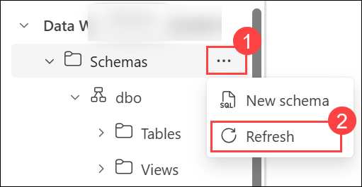
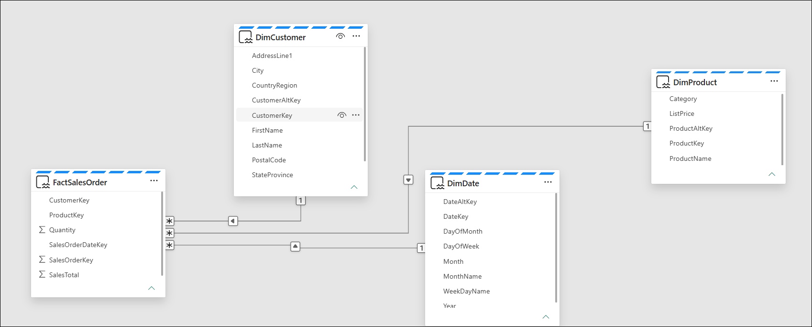
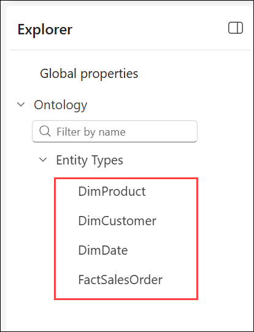
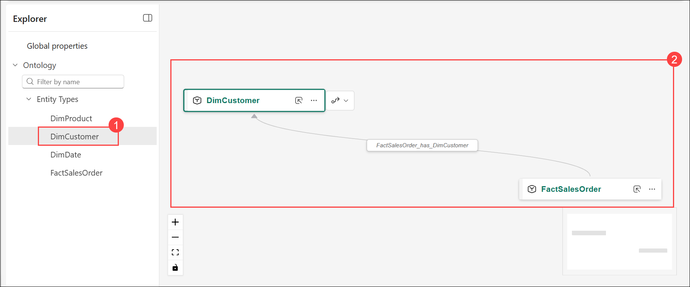
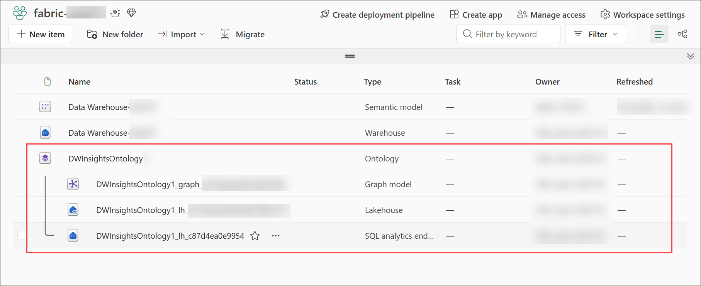
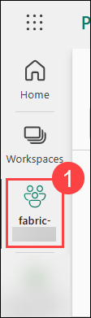
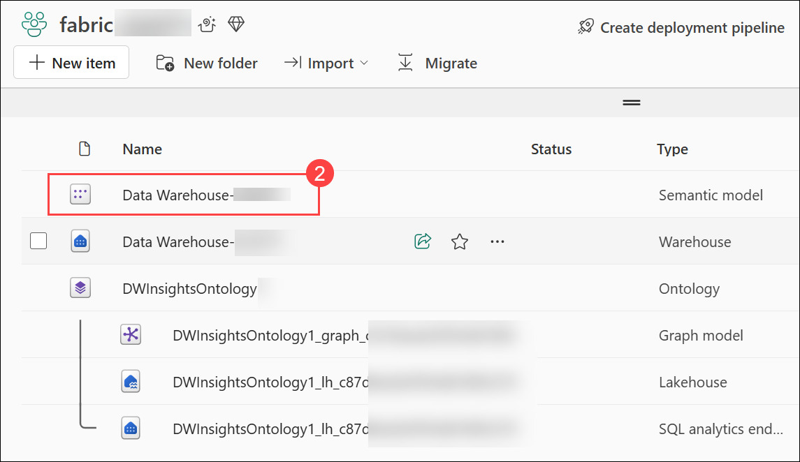

#  Exercise 1: Activate Fabric IQ across the workspace and run an IQ-guided code generation sprint in Spark and DAX

### Estimated Duration: **120 Minutes**

## Overview

In this exercise, you will activate Fabric IQ across the workspace and run IQ-guided code generation sprints in both DAX and Spark. You will create the shared workspace, build a data warehouse with a retail star schema, create a semantic model with relationships, enable the Fabric IQ preview features at the tenant level, and publish an ontology generated from the semantic model. You will then run a three-prompt IQ-guided DAX sprint using Copilot in DAX query view, followed by a six-prompt IQ-guided Spark code generation sprint using notebook Copilot over sales order data in a lakehouse. You will review and validate every piece of generated code before accepting it.

The ontology you publish in this exercise establishes the shared business vocabulary for the lab and serves as the semantic foundation for the Fabric Data Agent you will build in Exercise 2.

## Lab objectives

You will be able to complete the following tasks:

- Task 1: Sign in, assign the Fabric Administrator role, and create the workspace
- Task 2: Create and populate the data warehouse
- Task 3: Create the semantic model and define relationships
- Task 4: Enable the Fabric IQ preview features and publish the ontology
- Task 5: Run an IQ-guided DAX sprint
- Task 6: Create a lakehouse and upload files
- Task 7: Create a notebook
- Task 8: Load data into a dataframe
- Task 9: Run an IQ-guided Spark code generation sprint
- Task 10: Save the notebook and end the Spark session

#### Task 1: Sign in, assign the Fabric Administrator role, and create the workspace

In this task, you will assign yourself the Fabric Administrator role in Microsoft Entra ID, sign in to Microsoft Fabric, and create the workspace that will be shared across all three exercises in this module, backed by the pre-provisioned Fabric capacity.

1. In the Azure portal, search for **Microsoft Entra ID (1)** using the search bar, and then select **Microsoft Entra ID (2)** from the results.

    

1. Under **Manage (1)**, navigate to **Roles and administrators (2)**.

    

1. In the **Roles and administrators** page, search for **Fabric Administrator (1)**, and click on it **(2)**.

    

1. You will be taken to the **Fabric Administrator | Assignments** page. From here, assign yourself the **Fabric Administrator** role by selecting **+ Add assignments**.

    

1. Ensure you **check the box (1)** next to your username, verify that it appears under **Selected (2)**, and then select **Add (3)** to complete the assignment.

    

1. Confirm the **Fabric Administrator** role has been added by selecting **Refresh (1)** on the Fabric Administrators | Assignments page. Once the assignment is visible **(2)**, the role assignment is complete.

    

1. Copy the **Microsoft Fabric homepage link** and open it in a new browser tab inside the VM. Sign in using the following credentials:

   ```
   https://app.fabric.microsoft.com
   ```

    - **Email/Username:** <inject key="AzureAdUserEmail" enableCopy="true"/>
    - **Password:** <inject key="AzureAdUserPassword" enableCopy="true"/>

   >**Note**: In case a sign-up page asks for a phone number, you can enter a dummy phone number to proceed.

1. Select the **Profile (1)** icon, expand the **Start trial (2)** menu, and then select **Fabric and Power BI (3)**.

    

1. In the **Activate your 60-day free Fabric and Power BI trial** dialog, keep the default trial capacity region and click **Activate**.

    

1. When the **Successfully upgraded to a free Microsoft Fabric trial** message appears, click **OK**.

    

1. If an **Invite teammates to try Fabric** dialog appears, close it using the **X** in the top-right corner.

    

    > **Note:** The per-user trial provides the Power BI authoring license for this lab. You will still assign the workspace to the pre-provisioned **fabric<inject key="DeploymentID" enableCopy="false"/>** capacity in the next steps the trial is for the user license, not for the workspace capacity.

1. Select **Workspaces (1)** and click on **+ New workspace (2)**.

    

1. Fill out the **Create a workspace** form with the following details:

    - **Name:** Enter **fabric-<inject key="DeploymentID" enableCopy="false"/>**

        

    - **Advanced:** Expand it and under **License mode**, select **Fabric (1)**, under **Capacity** select available **fabric<inject key="DeploymentID" enableCopy="false"/> - <inject key="Region"></inject> (2)** and click on **Apply (3)** to create and open the workspace.

        

1. Confirm that the new workspace has opened successfully **(1)** and verify that the **+ New item (2)** option is available.

    

> **Congratulations** on completing the task! Now, it's time to validate it. Here are the steps:
> - Navigate to the Lab Validation Page from the upper right corner in the lab guide section.
> - Hit the Validate button for the corresponding task. If you receive a success message, you can proceed to the next task.
> - If not, carefully read the error message and retry the step, following the instructions in the lab guide.
> - If you need any assistance, please contact us at cloudlabs-support@spektrasystems.com. We are available 24/7 to help you out.

<validation step="d8fedb37-4d03-4378-b6e2-10fd6126e2ef" />

## Task 2: Create and populate the data warehouse

In this task, you will create a Fabric Data Warehouse and populate it with a retail star schema using T-SQL scripts from `C:\LabFiles\Files`. This warehouse provides the analytical foundation for the semantic model in Task 3 and the IQ-guided DAX sprint in Task 5.

1. Navigate to your workspace **fabric-<inject key="DeploymentID" enableCopy="false"/> (1)**, click on **+ New item (2)** to create a new warehouse.

    

1. In the search box, search **Warehouse (1)** and select **Warehouse (2)** from the list.

    

1. In the **New warehouse** window, enter the following:

    - Name: **Data Warehouse-<inject key="DeploymentID" enableCopy="false"/>** **(1)**
    - Click on **Create (2)**

        

1. In your new warehouse, under **Build a warehouse**, select the **T-SQL** tile.

    

1. Enter the following **SQL Code (1)** and click the **&#9655; Run (2)** button to run the SQL script, which creates a new table named **DimProduct** in the **dbo** schema of the data warehouse.

    ```SQL
    CREATE TABLE dbo.DimProduct
    (
        ProductKey INTEGER NOT NULL,
        ProductAltKey VARCHAR(25) NULL,
        ProductName VARCHAR(50) NOT NULL,
        Category VARCHAR(50) NULL,
        ListPrice DECIMAL(5,2) NULL
    );
    GO
    ```

    

1. In the **Explorer** pane, expand **Schemas** > **dbo** > **Tables** and verify that the **DimProduct** table has been created.

    

    > **Note:** If you do not see the **DimProduct** table under **Tables**, select the **More options (1)** menu next to **Schemas** and then select **Refresh (2)**.

   

1. On the **Home** menu tab, use the **New SQL Query (1)** drop-down button and from the menu select **New SQL Query (2)** to create a new query, and enter the following INSERT statement:

    

    ```SQL
    INSERT INTO dbo.DimProduct
    VALUES
    (1, 'RING1', 'Bicycle bell', 'Accessories', 5.99),
    (2, 'BRITE1', 'Front light', 'Accessories', 15.49),
    (3, 'BRITE2', 'Rear light', 'Accessories', 15.49);
    GO
    ```

1. **Run** the **above query (1)** by clicking on **Run (2)** to insert three rows into the **DimProduct** table.

    

1. On the **Home** menu tab, use the **New SQL Query (1)** drop-down button and from the menu select **New SQL Query (2)** to create a new query.

    

1. Open the **Lab VM** and navigate to the following path: `C:\LabFiles\Files\`.

    

1. Open the file **`create-dw-01.txt`** and copy the Transact-SQL code related to the **`DimProduct`** table.

    

1. Paste the copied code into the new query window.

1. Next, open the files **`create-dw-02.txt`** and **`create-dw-03.txt`**, one after the other, and copy their contents.

1. Paste the code from both files **below the existing code** in the **same query window**.

1. Once you have combined the code from all three files into a single query window, click **Run** to execute the query. This will create a basic data warehouse schema and populate it with sample data. The execution should take approximately **30 seconds** to complete.

    

1. Use the **Refresh** button on the toolbar to refresh the view. Then in the **Explorer** pane, verify that the **dbo** schema in the data warehouse now contains the following four tables:

    - **DimCustomer**
    - **DimDate**
    - **DimProduct**
    - **FactSalesOrder**

        

        > **Note:** If the schema takes a while to load, just refresh the browser page.

## Task 3: Create the semantic model and define relationships

In this task, you will create a semantic model from the data warehouse tables, switch to editing mode, and define the three many-to-one relationships required for the ontology generation in Task 4 and the IQ-guided DAX sprint in Task 5.

1. With **Data Warehouse-<inject key="DeploymentID" enableCopy="false"/>** open, click on **New semantic model** from the toolbar on the top.

    

1. In the **New semantic model** window, enter the name **Data Warehouse-<inject key="DeploymentID" enableCopy="false"/> (1)**, verify the **Workspace** is **fabric-<inject key="DeploymentID" enableCopy="false"/> (2)**, and under **Storage mode** keep the default **Direct Lake on SQL (3)** selected. Then select the following tables **(4)** and click **Confirm (5)**:

    - **DimCustomer**
    - **DimDate**
    - **DimProduct**
    - **FactSalesOrder**

        

1. From the left pane, click on **fabric-<inject key="DeploymentID" enableCopy="false"/>** and select the **Data Warehouse-<inject key="DeploymentID" enableCopy="false"/>** Semantic model to open it. If it opens in viewing mode, use the mode drop-down in the top-right corner **(1)** and switch to **Editing (2)**.

    

    > **Note:** If the Editing option is unavailable, ensure that **Users can edit data models in the Power BI service (preview)** is enabled in the workspace settings.

1. Drag the **ProductKey** field from the **FactSalesOrder** table and drop it on the **ProductKey** field in the **DimProduct** table. Then confirm the following relationship details.

    - From table: **FactSalesOrder (1)**
    - Column: **ProductKey (2)**
    - To table: **DimProduct (3)**
    - Column: **ProductKey (4)**
    - Cardinality: **Many to one (\*:1) (5)**
    - Cross filter direction: **Single (6)**
    - Make this relationship active: **Selected (7)**
    - Assume referential integrity: **Unselected (8)**
    - Click **Save (9)**.

        

1. Repeat the process to create many-to-one relationships between the following tables and click on Save after each.each.

    - **FactSalesOrder.CustomerKey** &#8594; **DimCustomer.CustomerKey**

        

    - **FactSalesOrder.SalesOrderDateKey** &#8594; **DimDate.DateKey**

        

    > **Note:** You can also create the relationships from the ribbon by selecting **Manage relationships** > **+ New relationship** and entering the same details this is the flow used in the current Microsoft ontology tutorial. Both approaches produce the same result.

1. When all of the relationships have been defined, the model should look like this:

    

## Task 4: Enable the Fabric IQ preview features and publish the ontology

In this task, you will enable the tenant settings required for the Fabric IQ preview features — ontology, graph, Data Agent, and the Copilot capabilities they depend on — and then generate and publish an ontology from the **Data Warehouse-<inject key="DeploymentID" enableCopy="false"/>** semantic model. The published ontology defines the shared business vocabulary that the Fabric Data Agent will use in Exercise 3.

1. From the **fabric-<inject key="DeploymentID" enableCopy="false"/>** workspace, click the **Settings (gear) icon (1)** in the top-right corner and select **Admin portal (2)**.

    

1. In the **Admin portal**, select **Tenant settings (1)**. Search for **Copilot (2)** and expand **Copilot and Azure OpenAI Service (3)**. Verify that **Users can use Copilot and other features powered by Azure OpenAI (4)** is **Enabled (5)**. If you make any changes, select **Apply (6)**.

    

1. In the same **Copilot and Azure OpenAI Service** group, expand **Data sent to Azure OpenAI can be processed outside your capacity's geographic region, compliance boundary, or national cloud instance** and confirm it is **Enabled (1)**. If it is disabled, enable it and click **Apply (2)**.

    

1. Repeat for **Data sent to Azure OpenAI can be stored outside your capacity's geographic region, compliance boundary, or national cloud instance (1)** confirm it is **Enabled (2)**, and if disabled, enable it and click **Apply (3)**.

    

    > **Note:** The two cross-geo settings are required when the capacity's region is outside the EU data boundary and the US. Enabling them ensures the Copilot, notebook Copilot, and Data Agent experiences in this module work regardless of the capacity region assigned to your lab environment.

1. In the tenant settings search box, search for **Ontology (1)**, expand the **Ontology item (preview)** setting **(2)**, set it to **Enabled** for the entire organization, and click **Apply (3)**.

    

1. Search for **XMLA (1)**, expand **Allow XMLA endpoints and Analyze in Excel with on-premises semantic models (2)**, and confirm the toggle is **Enabled (3)**. If it is disabled, enable it and click **Apply (4)**.

    

    > **Note:** The XMLA endpoint setting is required to generate an ontology from a semantic model.

    > **Important:** Tenant settings can take up to one hour to take effect, although changes are usually applied within a few minutes. If an item type or Copilot feature does not appear immediately in the following steps, wait a few minutes, refresh the browser, and try again.

1. Navigate to your workspace **fabric-<inject key="DeploymentID" enableCopy="false"/> (1)**, click on **+ New item (2)** to create a new warehouse.

    

1. In the **New item** panel, search for **Ontology (1)** and confirm that **Ontology (preview) (2)** now appears in the results. Close the **New item** panel without creating the item you will generate the ontology directly from the semantic model in the next step.

    

1. Naviagte back to **Data Warehouse-<inject key="DeploymentID" enableCopy="false"/> (1)** semantic model, and from the ribbon select **Generate Ontology (2)**.

    

    > **Note:** If the semantic model is not open, you can also select **Generate Ontology** directly from the semantic model's item overview page in the workspace.

1. On the **Generate an ontology from this Semantic Model** screen, review the description of what the ontology will contain and click **Get started**.

    

1. In the **New Ontology** dialog, enter the name **DWInsightsOntology (1)**, verify the **Location** is set to the **fabric-<inject key="DeploymentID" enableCopy="false"/> (2)** workspace, and click **Create (3)**.

    

    > **Important:** Do not include spaces in the ontology name item creation fails with a generic *An error occurred* message if the name contains spaces. If you see this error, correct the name and select **Create** again.

1. After generation completes, the ontology editor opens. In the **Explorer** pane, expand **Entity Types (1)** and confirm the four entity types generated from your semantic model are listed **DimProduct**, **DimCustomer**, **DimDate**, and **FactSalesOrder**.

    

1. Select **DimCustomer (1)** from the entity type list. The graph canvas displays the entity and its connections confirm the **FactSalesOrder_has_DimCustomer (2)** relationship appears, showing that the relationship you defined in Task 3 carried through into the ontology. Selecting **DimProduct** or **DimDate** shows their relationships to **FactSalesOrder** in the same way.

    

    > **Note:** Selecting an entity type also surfaces the **+ Add relationship** and **View Entity Type details** options in the toolbar. These allow you to extend the ontology manually no changes are needed for this lab.

1. The ontology editor saves your ontology automatically as it is created. If a **Publish** or **Save** option is shown in the toolbar of your editor version, select it to confirm the changes.

1. Navigate back to the **fabric-<inject key="DeploymentID" enableCopy="false"/>** workspace and confirm that **DWInsightsOntology (1)** now appears in the workspace item list.

    > **Note:** The ontology automatically creates supporting items in the workspace a graph item and one or more lakehouses prefixed with **DWInsightsOntology_**. These store the ontology's data bindings. Do not delete or modify them.

    

    > **Note:** After you click **Create**, a **Generating Ontology** screen appears while Fabric builds the entity types and processes the data bindings. This one-time setup typically completes in a few minutes wait on the page, it updates automatically when generation finishes.

## Task 5: Run an IQ-guided DAX sprint

In this task, you will open the **Data Warehouse-<inject key="DeploymentID" enableCopy="false"/>** semantic model in DAX query view and use Copilot to generate and refine three DAX measures against the retail star schema. Copilot in DAX query view is grounded in the semantic model you built in Task 3 the tables, columns, and relationships you defined directly shape the quality of the generated DAX, which is why a well-modeled schema matters before bringing AI into the loop.

> **Note:** Copilot requires the workspace to be assigned to a paid Fabric capacity (F2 or higher) and the Copilot tenant settings you enabled in Task 4. If the Copilot pane is unavailable, verify the workspace capacity assignment from Task 1, wait a few minutes for the tenant settings to propagate, and refresh the browser.

1. In the **fabric-<inject key="DeploymentID" enableCopy="false"/> (1)** workspace, open the **Data Warehouse-<inject key="DeploymentID" enableCopy="false"/> (2)** semantic model.

    

    

1. The semantic model opens in the model editing view, showing the four tables and their relationships. At the bottom-left of the window, switch from **Model view** to **DAX query view**.

    

    > **Note:** If the model opens in a read-only item page instead, select **Write DAX queries** from the command bar to reach the same DAX query view. If neither option is available, ensure that **Users can edit data models in the Power BI service (preview)** is enabled in the workspace settings.

1. When DAX query view opens, in the **Data** pane, locate the model objects for your retail scenario:

    - Sales amount or revenue: **FactSalesOrder[SalesTotal]**
    - Product category: **DimProduct[Category]**
    - Month or year: **DimDate[MonthName]**, **DimDate[Year]**
    - Customer region: **DimCustomer[CountryRegion]**

1. In the query editor, run the following validation query to confirm your model is working correctly:

    ```dax
    EVALUATE
    TOPN(
        10,
        VALUES(DimProduct[Category])
    )
    ```

1. Select **Run** and confirm the query returns product category values from your data.

    

1. Open the **Copilot (1)** pane and enter the following prompt:

    ```
    Write a DAX query for my retail semantic model that defines measures for total sales revenue and total units sold using FactSalesOrder, then summarizes the results by product category and month.
    ```

    

1. Wait for Copilot to generate the query. Before running anything, review the generated DAX carefully and check the following:

    - Are the table names real tables from your model **FactSalesOrder**, **DimProduct**, **DimDate**?
    - Are the column names real columns **SalesTotal**, **Quantity**, **Category**, **MonthName**?
    - Does the time-intelligence logic use the correct date table and date column?

1. If the query uses names that do not exist in your model, replace them manually with the correct names from the **Data** pane. Then **Run** the query. Use or adapt the following reference query if needed:

    ```dax
    DEFINE
        MEASURE FactSalesOrder[Total Sales Revenue] =
            SUM(FactSalesOrder[SalesTotal])

        MEASURE FactSalesOrder[Total Units Sold] =
            SUM(FactSalesOrder[Quantity])
    EVALUATE
    SUMMARIZECOLUMNS(
        DimProduct[Category],
        DimDate[MonthName],
        "Total Sales Revenue", [Total Sales Revenue],
        "Total Units Sold", [Total Units Sold]
    )
    ORDER BY [Total Sales Revenue] DESC
    ```

    > **Important:** Treat Copilot-generated DAX as a starting draft. Always review column and table references against the **Data** pane before running.

    

1. Enter the following second prompt in the Copilot pane:

    ```
    Refine this DAX for retail analysis. Add a measure for year-over-year sales comparison using DimDate, and summarize the result by region using DimCustomer[CountryRegion].
    ```

1. Review the generated changes. Keep only the logic that makes sense for your model. Correct any mismatched column or table names, then **Run** the query and verify the output includes a prior-year comparison column and a region column.

    

1. Enter the following third prompt in the Copilot pane:

    ```
    Write a DAX query that identifies the top 5 products by total sales revenue and shows their category, product name, and revenue ranked in descending order.
    ```

1. Review the generated DAX, correct any mismatched references, then **Run** the query and confirm the output returns the top 5 products by revenue.

    

1. When you have validated all three measures, select **Update model with changes (1)** the button next to **Run** at the top of the query editor to save the trusted measures to the semantic model. The button displays a count of pending changes, for example **Update model with changes (2)**.

    

1. In the **Are you sure?** confirmation dialog, click **Update model** to apply the measures.

    

    > **Note:** The banner stating *DAX queries are discarded on close* refers only to the query text in this view measures applied through **Update model with changes** are saved permanently to the semantic model.

## Task 6: Create a lakehouse and upload files

In this task, you will create a lakehouse to store the sales order data and upload the orders folder from the lab files.

1. Navigate to your workspace **fabric-<inject key="DeploymentID" enableCopy="false"/> (1)**, click on **+ New item (2)** to create a new warehouse.

    

1. In the **fabric-<inject key="DeploymentID" enableCopy="false"/>** workspace, click on **+ New item (1)**, search for **Lakehouse (2)** in the search bar, then select the **Lakehouse (3)** from the results to proceed.

    

1. In the **New Lakehouse** dialog, enter the **Name** as **fabric_lakehouse<inject key="DeploymentID" enableCopy="false"/> (1)**, verify the **Location** is **fabric-<inject key="DeploymentID" enableCopy="false"/> (2)**, **uncheck the Lakehouse schemas box (3)** it is checked by default and click **Create (4)**.

    

1. From the Explorer pane, hover the mouse next to the **Files** folder, click the **ellipsis (...) (1)**, choose **Upload (2)**, and then click **Upload folder (3)** to import a folder from your local machine.

    

1. In the Upload folder dialog, click the **folder** icon to browse.

    

1. Browse to `C:\LabFiles\Files`, select the **orders (1)** folder, and click **Upload (2)** to initiate the upload process.

    

1. Click **Upload** in the confirmation pop-up to proceed with uploading all files from the orders folder.

    

1. After uploading, expand **Files (1)** in the Explorer pane, select the **orders (2)** folder, and verify that the CSV files are listed.

    

## Task 7: Create a notebook

In this task, you will create a notebook and attach it to the **fabric_lakehouse<inject key="DeploymentID" enableCopy="false"/>** lakehouse so that the IQ-guided Spark sprint can read and write data.

1. Navigate to your workspace **fabric-<inject key="DeploymentID" enableCopy="false"/> (1)**, click on **+ New item (2)** to create a new warehouse.

    

1. In the **fabric-<inject key="DeploymentID" enableCopy="false"/>** workspace, click on **+ New item (1)**, search for **Notebook (2)** in the search bar, and then select **Notebook (3)** from the results.

    

1. On the **New Notebook** page, enter a **Name (1)**, verify that the correct **Location (2)** is selected, and then select **Create (3)**.

    

1. If a **Notebook Copilot Updates** welcome dialog appears, click **Skip for now** to dismiss it.

    

1. From the **Explorer** panel on the left, under the **Data items** tab, open the **Add data items (1)** dropdown and select **From OneLake catalog (2)**.

    

1. Select the checkbox next to **fabric_lakehouse<inject key="DeploymentID" enableCopy="false"/> (1)**, then click **Add (2)** in the bottom-right corner.

    

1. Select the first cell (which is currently a code cell), then click the **M↓** button in the top-right dynamic toolbar to convert it to a **markdown** cell.

    

1. Click the **Edit** icon in the top-right corner of the cell, then replace the existing content with the code below.

    

    ```
    # IQ-guided Spark sprint sales order analysis
    Use notebook Copilot in this notebook to generate and refine PySpark code over the sales order data.
    ```

1. Click anywhere outside the cell in the notebook to exit editing mode and view the rendered markdown.

    

## Task 8: Load data into a dataframe

In this task, you will load the sales order CSV data into a Spark dataframe with a defined schema so that the IQ-guided sprint in Task 9 has structured, typed data to work with.

1. With the notebook open, expand the **fabric_lakehouse<inject key="DeploymentID" enableCopy="false"/> (1)** under **Data items**, on the **Explorer** page, then expand **Files (2)**, select the **orders (3)** folder, click the **ellipsis (...) (4)** menu next to 2019.csv, and choose **Load data (5)** -> **Spark (6)**.

    

1. A **new code** cell with the following code will be added to the notebook:

    ```python
    df = spark.read.format("csv").option("header","true").load("Files/orders/2019.csv")
    # df now is a Spark DataFrame containing CSV data from "Files/orders/2019.csv".
    display(df)
    ```
    

1. Use the **Run** cell button on the left side of the cell to execute it.

    

    > **Note:** Since this is the first time running Spark code, a Spark session will be started, which may take about a minute to complete. Subsequent runs will execute faster.

1. Modify the code to define the correct schema and load all CSV files in the orders folder using a wildcard:

    ```python
    from pyspark.sql.types import *

    orderSchema = StructType([
        StructField("SalesOrderNumber", StringType()),
        StructField("SalesOrderLineNumber", IntegerType()),
        StructField("OrderDate", DateType()),
        StructField("CustomerName", StringType()),
        StructField("Email", StringType()),
        StructField("Item", StringType()),
        StructField("Quantity", IntegerType()),
        StructField("UnitPrice", FloatType()),
        StructField("Tax", FloatType())
    ])

    df = spark.read.format("csv").schema(orderSchema).load("Files/orders/*.csv")
    display(df)
    ```
     

1. **Run (1)** the modified code cell and review the **output (2)**, which should now include sales data from 2019, 2020, and 2021 with correct column names.

    

    >**Note:** Only a subset of the rows is displayed, so you may not immediately see data from all years in the output.

## Task 9: Run an IQ-guided Spark code generation sprint

In this task, you will use notebook Copilot to run a six-prompt IQ-guided Spark code generation sprint. For each prompt, you will review the generated PySpark code before inserting and running it.

> **Note:** Spark supports multiple coding languages. In this exercise, we will use *PySpark*, which is a Spark-optimized variant of Python and the default language in Fabric notebooks.

1. Open the notebook **Copilot** pane from the toolbar.

    

    > **Note:** Notebook Copilot requires the workspace to be on a paid Fabric capacity (F2 or higher) with the **Users can use Copilot and other features powered by Azure OpenAI** tenant setting and the cross-geo Azure OpenAI settings enabled, which you configured in Task 4 of this exercise. If the Copilot pane is unavailable, wait a few minutes for tenant settings to propagate and refresh the browser or paste and run the reference code cells provided in each step below.

1. Enter the following **Prompt 1** in the Copilot pane:

    ```
    In the existing dataframe df, cast the UnitPrice and Tax columns to DoubleType and display the first 10 rows.
    ```

    

1. Review the generated code. Verify it references the correct dataframe and column names, then click **Insert** to add it to the notebook and click **&#9655; Run cell**.

    > **Note:** When Copilot inserts a cell, an **Add a new cell below cell number** prompt may appear click **Allow** to let Copilot add the cell.

    

    ```python
    from pyspark.sql.types import DoubleType
    from pyspark.sql.functions import col

    df = df.withColumn("UnitPrice", col("UnitPrice").cast(DoubleType())) \
           .withColumn("Tax", col("Tax").cast(DoubleType()))
    display(df.limit(10))
    ```

    

1. Enter the following **Prompt 2** in the Copilot pane:

    ```
    Add a GrossRevenue column calculated as (UnitPrice multiplied by Quantity) plus Tax. Display a sample of the result.
    ```

1. Review the generated code, insert it into the notebook, and click **&#9655; Run cell**.

    ```python
    df = df.withColumn("GrossRevenue", (col("UnitPrice") * col("Quantity")) + col("Tax"))
    display(df.select("SalesOrderNumber", "Item", "Quantity", "UnitPrice", "Tax", "GrossRevenue").limit(10))
    ```

    

1. Enter the following **Prompt 3** in the Copilot pane:

    ```
    Aggregate the dataframe by Item and the year extracted from OrderDate, calculating total quantity sold and total gross revenue. Sort the result by total gross revenue descending.
    ```

1. Review the generated code, insert it into the notebook, and click **&#9655; Run cell**. Confirm the output shows aggregated totals per item per year.

    ```python
    from pyspark.sql.functions import year, sum as fsum

    revenue_df = df.groupBy("Item", year(col("OrderDate")).alias("OrderYear")).agg(
        fsum("Quantity").alias("TotalQuantity"),
        fsum("GrossRevenue").alias("TotalGrossRevenue")
    ).orderBy("TotalGrossRevenue", ascending=False)

    display(revenue_df)
    ```

    

1. Enter the following **Prompt 4** in the Copilot pane:

    ```
    Write the aggregated revenue dataframe to a managed Delta table named SalesRevenueSummary in the attached lakehouse using overwrite mode. Print a confirmation message when the write completes.
    ```

1. Review the generated code, confirm the write mode is **overwrite**, insert it into the notebook, and click **&#9655; Run cell**. Wait for the confirmation message.

    ```python
    revenue_df.write.format("delta").mode("overwrite").saveAsTable("SalesRevenueSummary")
    print("SalesRevenueSummary table saved!")
    ```

1. In the **Explorer** pane, click the **ellipsis (...) (1)** menu next to **Tables**, select **Refresh (2)**, and verify that **SalesRevenueSummary (3)** now appears.

1. Enter the following **Prompt 5** in the Copilot pane:

    ```
    Add a data quality check that fails the notebook run if more than 5% of rows in the dataframe have a null value in the Item column. Print the null ratio whether the check passes or fails.
    ```

1. Review the generated code, insert it into the notebook, and click **&#9655; Run cell**. Confirm the data quality check passes and the null ratio is printed.

    ```python
    null_count = df.filter(col("Item").isNull()).count()
    total_count = df.count()
    null_ratio = null_count / total_count

    print(f"Null Item ratio: {null_ratio:.2%}")
    assert null_ratio <= 0.05, f"Data quality check FAILED: null Item ratio {null_ratio:.2%} exceeds 5%"
    print("Data quality check passed.")
    ```


1. Enter the following **Prompt 6** in the Copilot pane:

    ```
    Write a Spark SQL cell using the %%sql magic to run OPTIMIZE on the SalesRevenueSummary Delta table with Z-ORDER on the Item column to improve downstream query performance.
    ```

1. Review the generated code, insert it into the notebook, and click **&#9655; Run cell**. Confirm the OPTIMIZE command completes successfully.

    ```sql
    %%sql
    OPTIMIZE SalesRevenueSummary
    ZORDER BY (Item);
    ```

## Task 10: Save the notebook and end the Spark session

In this task, you will save the notebook with a meaningful name and end the Spark session to free up resources.

1. In the notebook menu bar, click the ⚙️ **Settings (1)** icon to view the notebook settings, and set the **Name** of the notebook to **Spark IQ Sprint Notebook (2)**, then close the settings pane.

    

    

1. On the notebook menu, select **Stop session** to end the Spark session.

    

    > **Note:** The stop session icon is present next to the **Start Session** option.

## Summary

In this exercise, you:

- Assigned the Fabric Administrator role and created the **fabric-<inject key="DeploymentID" enableCopy="false"/>** workspace on the pre-provisioned Fabric capacity, shared across all three exercises in this lab.
- Created the **Data Warehouse-<inject key="DeploymentID" enableCopy="false"/>** with a retail star schema and built its semantic model with three many-to-one relationships.
- Activated Fabric IQ across the workspace by enabling the ontology, graph, Data Agent, and Copilot tenant settings, and published the **DWInsightsOntology** generated from the semantic model.
- Ran a three-prompt IQ-guided DAX sprint using Copilot in DAX query view and saved validated measures to the semantic model.
- Created the **fabric_lakehouse<inject key="DeploymentID" enableCopy="false"/>** lakehouse, loaded the sales order data into a Spark dataframe with a defined schema, and ran a six-prompt IQ-guided Spark code generation sprint using notebook Copilot — casting columns, computing gross revenue, aggregating, saving a managed Delta table, running a data quality check, and optimizing with Z-ORDER.

### You have successfully completed the exercise. Click on Next >> to proceed with the next exercise.


