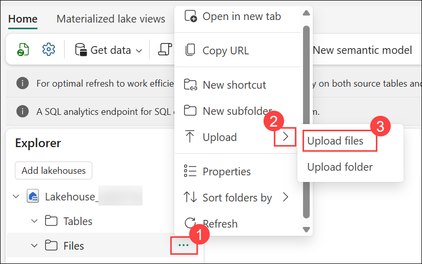
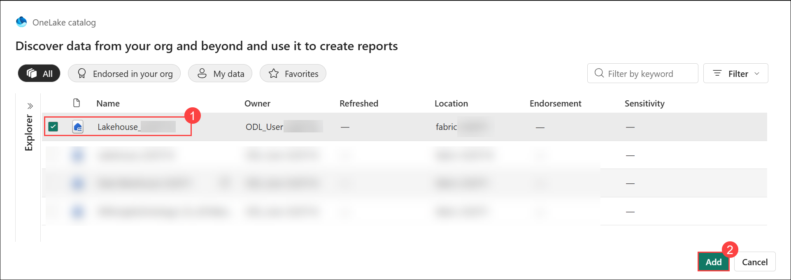
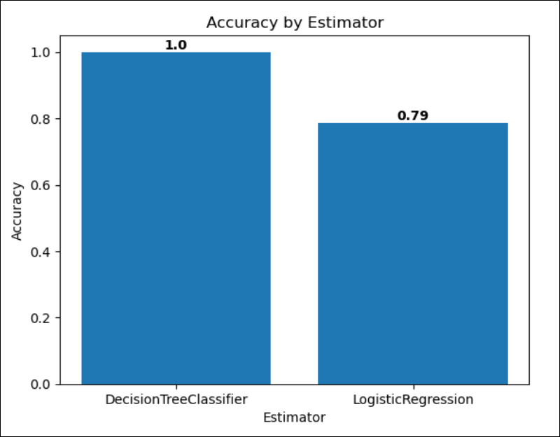

#  Exercise 2: Build a Fabric Data Agent over the trained model output for natural-language model queries

### Estimated Duration: **60 Minutes**

## Overview

In this exercise, you will upload the customer churn dataset to the lakehouse, train and compare two classification models using Scikit-Learn and MLflow, and save the best-performing model. You will then reload the registered model, score it against the full dataset to generate churn predictions, and save those predictions as a managed Delta table. Finally, you will create a Fabric Data Agent over the prediction table and test it with natural-language queries to surface customer churn insights without writing any SQL or DAX.

> **Note:** This exercise uses the same **fabric-<inject key="DeploymentID" enableCopy="false"/>** workspace that you created in **Exercise 1, Task 1 of this lab**. All three exercises in this lab share this single workspace. Sign in and navigate to that workspace before beginning Task 1.

## Lab objectives

You will be able to complete the following tasks:

- Task 1: Create a lakehouse and upload the churn dataset
- Task 2: Create a notebook and load data into a dataframe
- Task 3: Train a machine learning model
- Task 4: Explore your experiments and save the model
- Task 5: Score the model and save predictions to the lakehouse
- Task 6: Build and test a Fabric Data Agent over the predictions

## Task 1: Create a lakehouse and upload the churn dataset

In this task, you will create a new lakehouse in the shared workspace and upload the churn dataset that will be used for model training and scoring.

1. Open a browser and go to <https://app.fabric.microsoft.com>. Sign in by using the following credentials:

    - **Email/Username:** <inject key="AzureAdUserEmail" enableCopy="true"/>
    - **Password:** <inject key="AzureAdUserPassword" enableCopy="true"/>

1. From the left pane, select the **fabric-<inject key="DeploymentID" enableCopy="false"/>** workspace, click on **+ New item (3)** to create a new lakehouse.

    

1. In the search box, search for **Lakehouse (1)** and select **Lakehouse (2)** from the list.

    

1. In the **New lakehouse** window, enter the **Name** as **Lakehouse_<inject key="DeploymentID" enableCopy="false"/> (1)** and make sure to **uncheck the Lakehouse schemas box (2)** it is checked by default, then click on **Create (3)**.

    

1. In the left pane, go back to your Lakehouse. In the **Explorer** pane, hover and open the **Ellipsis (…) (1)** menu next to the **Files** node, then choose **Upload (2)** and select **Upload files (3)**.

    

1. In the **Upload files** section, click on the **folder (1)** icon.

    

1. Navigate to **`C:\LabFiles\Files` (1)**, select the **churn.csv (2)** file and click on **Open (3)**.

    

1. In the **Upload files** section after **churn.csv** file is added, click **Upload**.

    

1. After the files have been uploaded, expand **Files** and verify that the CSV file has been uploaded.

    

> **Congratulations** on completing the task! Now, it's time to validate it. Here are the steps:
> - Navigate to the Lab Validation Page from the upper right corner in the lab guide section.
> - Hit the Validate button for the corresponding task. If you receive a success message, you can proceed to the next task.
> - If not, carefully read the error message and retry the step, following the instructions in the lab guide.
> - If you need any assistance, please contact us at cloudlabs-support@spektrasystems.com. We are available 24/7 to help you out.

<validation step="80ed8398-d658-4ae5-a73e-b1b9a08c69e2" />

## Task 2: Create a notebook and load data into a dataframe

In this task, you will create a notebook, attach it to the **Lakehouse_<inject key="DeploymentID" enableCopy="false"/>** lakehouse, and load the churn data into a pandas DataFrame ready for model training.

1. Navigate to your workspace **fabric-<inject key="DeploymentID" enableCopy="false"/> (1)**, click on **+ New item (2)** to create a new warehouse.

    

1. In the search box, search **Notebook (1)** and select **Notebook (2)** from the list.

    

1. On the **New Notebook** page, enter a **Name (1)**, verify that the correct **Location (2)** is selected, and then select **Create (3)**.

    

1. After a few seconds, a new notebook containing a single *cell* will open. Notebooks are made up of one or more cells that can contain *code* or *markdown* (formatted text).

1. Select the first cell (which is currently a *code* cell), and then in the dynamic toolbar at its top-right, use the **M&#8595;** button to convert the cell to a *markdown* cell.

    

1. Use the **&#128393;** button to switch the cell to editing mode, then delete the content and enter the following text:

    ```text
    # Train a machine learning model and build a Fabric Data Agent

    Use the code in this notebook to train, score, and expose a churn prediction model.
    ```

1. In the Explorer pane, click the **Add data items (1)** drop-down and select **From OneLake catalog (2)**.

    

1. Select the lakehouse named **Lakehouse_<inject key="DeploymentID" enableCopy="false"/> (1)** and click **Add (2)**.

    

1. Once after connecting to the existing lakehouse, you should be able to see the **Lakehouse_<inject key="DeploymentID" enableCopy="false"/>** under **Data Items**.

    

1. Click the **Files (1)** folder so that the CSV file is listed next to the notebook editor.

1. Right click on **churn.csv (2)**, and click on **Load data (3)** and then select **Pandas (4)**.

    

1. A new code cell containing the following code should be added to the notebook:

    ```python
    import pandas as pd
    # Load data into pandas DataFrame from "/lakehouse/default/" + "Files/churn.csv"
    df = pd.read_csv("/lakehouse/default/" + "Files/churn.csv")
    display(df)
    ```

    > **Note:** You can hide the pane containing the files on the left by using its **<<** icon. Doing so will help you focus on the notebook.

1. Use the **&#9655; Run cell** button on the left of the cell to run it.

    

    > **Note:** Since this is the first time you've run any Spark code in this session, the Spark pool must be started. This means that the first run can take a minute or so to complete. Subsequent runs will be quicker.

1. When the cell command has been completed, review the output below the cell, which should look similar to this:

    

1. The output shows the rows and columns of customer data from the churn.csv file.

## Task 3: Train a machine learning model

In this task, you will train two classification models Logistic Regression and Decision Tree to predict customer churn, tracking both with MLflow.

1. Enter the following **code (1)** in it:

    ```python
    from sklearn.model_selection import train_test_split

    print("Splitting data")
    X, y = df[['years_with_company','total_day_calls','total_eve_calls','total_night_calls',
               'total_intl_calls','average_call_minutes','total_customer_service_calls','age']].values, df['churn'].values

    X_train, X_test, y_train, y_test = train_test_split(X, y, test_size=0.30, random_state=0)
    ```

1. **Run (2)** the code cell you added, and note you're omitting 'CustomerID' from the dataset and splitting the data into a training and test dataset.

    

1. Add a new code cell to the notebook, enter the following code in it, and run it:

    ```python
    import mlflow
    experiment_name = "experiment-churn"
    mlflow.set_experiment(experiment_name)
    ```

    

1. The code creates an MLflow experiment named `experiment-churn`. Your models will be tracked in this experiment.

    

1. Add a new code cell to the notebook, enter the following code in it, and run it:

    ```python
    from sklearn.linear_model import LogisticRegression

    with mlflow.start_run():
        mlflow.autolog()
        model = LogisticRegression(C=1/0.1, solver="liblinear").fit(X_train, y_train)
        mlflow.log_param("estimator", "LogisticRegression")
    ```

    

1. Add a new code cell to the notebook, enter the following code in it, and run it:

    ```python
    from sklearn.tree import DecisionTreeClassifier

    with mlflow.start_run():
        mlflow.autolog()
        model = DecisionTreeClassifier().fit(X_train, y_train)
        mlflow.log_param("estimator", "DecisionTreeClassifier")
    ```

    >**Note:** If the cell fails, attempt to re-run the previous cell and then execute this cell again.

    

## Task 4: Explore your experiments and save the model

In this task, you will explore the MLflow experiment runs, compare model performance, and save the best-performing model to the workspace.

1. Add a new code cell to the notebook, enter the following code, and run it to plot a comparison of both models:

    ```python
    import matplotlib.pyplot as plt

    df_results = mlflow.search_runs(
        mlflow.get_experiment_by_name("experiment-churn").experiment_id,
        order_by=["start_time DESC"],
        max_results=2
    )[["metrics.training_accuracy_score", "params.estimator"]]

    fig, ax = plt.subplots()
    ax.bar(df_results["params.estimator"], df_results["metrics.training_accuracy_score"])
    ax.set_xlabel("Estimator")
    ax.set_ylabel("Accuracy")
    ax.set_title("Accuracy by Estimator")
    for i, v in enumerate(df_results["metrics.training_accuracy_score"]):
        ax.text(i, v, str(round(v, 2)), ha='center', va='bottom', fontweight='bold')
    plt.show()
    ```

1. The **output** should resemble the following image:

    

1. In the left pane, navigate to your **fabric-<inject key="DeploymentID" enableCopy="false"/>**. You will see the **experiment-churn** Experiment created.

    

1. Select the `experiment-churn` experiment to open it. If a **Notebooks, Experiments, and ML models** welcome dialog appears, click **Skip for now**.

    

    > **Note:** If you don't see any logged experiment runs, refresh the page.

1. Select the **View** tab and ensure the **List** layout is selected. Under the **Runs** tab, select the latest experiment run to open its details.

    

1. Select the **checkboxes** next to your latest **LogisticRegression** run **(1)** and your latest **DecisionTreeClassifier** run **(2)**. The **Metric comparison** pane appears below the run list.

    > **Note:** If you re-ran any training cells, the experiment contains more than two runs. Compare the latest run of each estimator you can identify them by the **training_accuracy_score** values or by opening a run to check its **estimator** parameter.

    

1. On the **Performance** tab, select the **Edit** icon to customize the chart.

    > By comparing accuracy per logged estimator, you can review which algorithm resulted in a better model.

    

1. In the **Personalize** pane, set the **Visualization type (1)** to **Bar**, set the **X-axis (2)** to **estimator_name**, and then select **Replace (3)**.

    

1. In the run details view, locate the **Save run as an ML model** card and click **Save (1)**.

    

    > **Note:** The **Save as ML model** button in the run list toolbar stays unavailable until a run is opened always save from the run details view as described here.

1. In the **Save as ML model** dialog, keep **Create a new ML model (1)** selected, keep the folder **model (2)**, enter the **ML model name** as **model-churn (3)**, and select **Save (4)**.

    

1. Select **View ML model** in the notification that appears at the top right of your screen when the model is created.

    

    >**Note:** The model, the experiment, and the experiment run are linked, allowing you to review how the model is trained.

## Task 5: Score the model and save predictions to the lakehouse

In this task, you will reload the registered **model-churn** model, score it against the full churn dataset to generate predictions, and save the results as a managed Delta table that the Fabric Data Agent will query in Task 6.

1. Select **Workspaces (1)** from the left navigation pane, and then select the **fabric-<inject key="DeploymentID" enableCopy="false" /> (2)** workspace.

    

1. Add a new code cell, enter the following, and run it to reload the churn data into the **df** DataFrame:

    ```python
    import pandas as pd
    df = pd.read_csv("/lakehouse/default/" + "Files/churn.csv")
    ```

    > **Note:** While you were exploring the experiment and model in Task 4, the notebook's Spark session may have expired and restarted. A new session does not retain variables from earlier cells, so **df** must be reloaded before scoring running this cell is required even if the session appears unchanged.

1. Add a new code cell, enter the following to reload the registered model from MLflow, and run it:

    ```python
    import mlflow.sklearn

    model_uri = "models:/model-churn/1"
    loaded_model = mlflow.sklearn.load_model(model_uri)
    print(f"Model loaded successfully from: {model_uri}")
    ```

    > **Note:** If the model is not found, verify that the **Save** step in Task 4 completed successfully and that the registered version is **1**.

    

     

1. Add a new code cell, enter the following to score the full dataset, and run it:

    ```python
    X_score = df[['years_with_company','total_day_calls','total_eve_calls','total_night_calls',
                  'total_intl_calls','average_call_minutes','total_customer_service_calls','age']].values

    predictions = loaded_model.predict(X_score)
    churn_probability = loaded_model.predict_proba(X_score)[:, 1]

    scored_df = df.copy()
    scored_df["ChurnPrediction"] = predictions
    scored_df["ChurnProbability"] = churn_probability.round(4)

    display(scored_df[["age","years_with_company","churn","ChurnPrediction","ChurnProbability"]].head(10))
    ```

    

     

1. Add a new code cell, enter the following to convert the scored pandas DataFrame to a Spark DataFrame and save it as a managed Delta table, then run it:

    ```python
    scored_spark_df = spark.createDataFrame(scored_df)
    scored_spark_df.write.format("delta").mode("overwrite").saveAsTable("churn_predictions")
    print("churn_predictions table saved!")
    ```

1. **Run** the cell and wait for the **churn_predictions table saved!** message.

    

1. In the **Explorer** pane, click the **ellipsis (...) (1)** menu next to **Tables**, select **Refresh (2)**, and confirm **churn_predictions (3)** appears in the lakehouse.

    

1. In the notebook menu bar, click the ⚙️ **Settings (1)** icon to view the notebook settings, and set the **Name** of the notebook to **Train and compare models notebook (2)**, then close the settings pane.

     

    

1. On the notebook menu, select &#9645;**Stop session** to end the Spark session.

    >**Note:** If you can't see the **Stop Session** option, it means the Spark session has already ended.

## Task 6: Build and test a Fabric Data Agent over the predictions

In this task, you will create a Fabric Data Agent grounded in the **churn_predictions** table and test it with natural-language queries to surface customer churn insights without writing any SQL or DAX.

> **Note:** Fabric Data Agent requires a paid Fabric capacity (F2 or higher) and the Copilot and cross-geo Azure OpenAI tenant settings you enabled in Exercise 1, Task 4 (plus **Users can create and share Data agent item types (preview)** where that setting is present in your tenant). If the Data agent item type does not appear, wait a few minutes for the tenant settings to propagate and refresh the browser.

1. Confirm that the new workspace has opened successfully **(1)** and verify that the **+ New item (2)** option is available.

    

1. In the **New item** pane, search for **Data agent (1)** and then select **Data agent (2)**.

    

1. Enter the name **churn-data-agent<inject key="DeploymentID" enableCopy="false"/> (1)** and click **Create (2)**.

    

1. If a **Welcome to Data Agent** tour dialog appears, click **Skip for now**.

    

1. In the Data Agent editor toolbar, click the **Add data (1)** drop-down and select the option to add from the **OneLake catalog (2)**.

    

1. Select **Lakehouse_<inject key="DeploymentID" enableCopy="false"/> (1)** and **Add (2)** it as the agent's data source.

    

    >**Note :** 

1. In the **Explorer** pane, on the **Data (1)** tab, expand **Lakehouse_<inject key="DeploymentID" enableCopy="false"/> > Schemas > dbo > Tables** and select the checkbox next to **churn_predictions (2)**, leaving all other objects unselected. This scopes the agent to the prediction table only.

    

1. In the toolbar, select **Agent instructions (1)** and enter the following, then save the instructions:

    ```
    You answer questions about predicted customer churn using the churn_predictions table.
    Always state the ChurnPrediction value (0 = not likely to churn, 1 = likely to churn) and the ChurnProbability as a percentage.
    When answering questions about high-risk customers, filter on rows where ChurnPrediction equals 1.
    Prefer concise answers with supporting figures.
    ```

    

    > **Important:** Enter the instructions in the **Agent instructions** pane, not in the **Test the agent's responses** chat. Text sent to the chat is only a test message — it is not saved as agent configuration and does not persist when the agent is published.

1. In the **Explorer** pane, select the **Setup (1)** tab and open the **Example queries** section for the lakehouse data source, then click **+ Add example (2)**.

    

1. Enter the following first example — a **Question (1)** with its matching **SQL query (2)** — and save it **(3)**:

    - Question:

        ```
        How many customers are predicted to churn?
        ```

    - Query:

        ```SQL
        SELECT COUNT(*) AS PredictedChurnCount
        FROM churn_predictions
        WHERE ChurnPrediction = 1;
        ```

        

1. Click **+ Add example (1)** again, enter the following second example **(2)**, and save it **(3)**:

    - Question:

        ```
        Which customers have the highest churn probability?
        ```

    - Query:

        ```SQL
        SELECT TOP 10 *
        FROM churn_predictions
        ORDER BY ChurnProbability DESC;
        ```

        

1. In the toolbar, click **Publish**.

     

1. In the chat pane, type the following question and press **Enter**:

    ```
    How many customers are predicted to churn?
    ```

    

1. Review the agent's answer. Expand the agent's **reasoning steps (1)** to confirm the SQL it ran against the **churn_predictions** table matches your expectations.

1. Ask a second question in the chat pane:

    ```
    What is the average churn probability for customers who are predicted to churn?
    ```

    

1. Review the response and confirm the agent queries the **ChurnProbability** and **ChurnPrediction** columns from **churn_predictions** correctly.

1. Ask a third question in the chat pane:

    ```
    Which age group has the highest number of customers predicted to churn?
    ```

1. Review the response and confirm the agent groups by the **age** column from the **churn_predictions** table.

    

## Summary

In this exercise, you:

- Created the **Lakehouse_<inject key="DeploymentID" enableCopy="false"/>** lakehouse and uploaded the churn.csv dataset.
- Created the **Train and compare models notebook** notebook, loaded the churn data into a pandas DataFrame, and trained Logistic Regression and Decision Tree classification models tracked by MLflow in the **experiment-churn** experiment.
- Compared model accuracy visually, saved the best-performing model as **model-churn**, reloaded it from the MLflow registry, scored it against the full dataset, and saved the predictions as the **churn_predictions** managed Delta table.
- Created and published the **churn-data-agent<inject key="DeploymentID" enableCopy="false"/>** Fabric Data Agent over the predictions table, configured AI instructions and example queries, and validated it with three natural-language questions about predicted customer churn.

### You have successfully completed the exercise. Click on Next >> to proceed with the next exercise.


